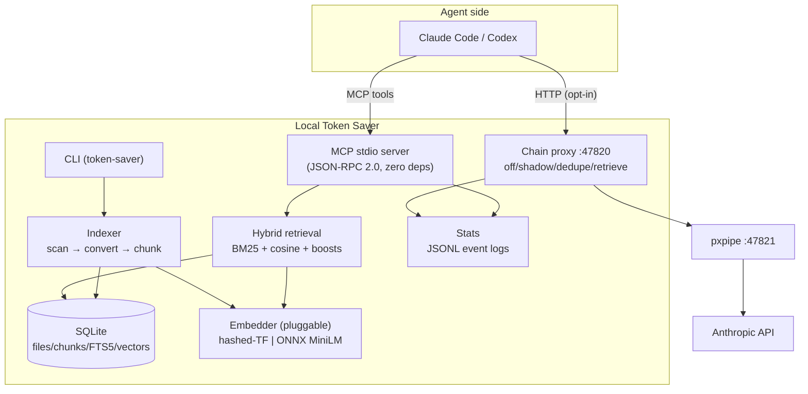

# System: Local Token Saver

Architecture review as of v0.3.0. Decisions are recorded as ADRs in
[`docs/adr/`](adr/); this document is the map.

## Requirements

### Functional
- Index arbitrary local folders (git not required): scan → PDF→Markdown
  conversion (cached) → parse/chunk → FTS5 + vector index.
- Hybrid retrieval (BM25 + vector cosine + path boosts) returning a budgeted,
  cited evidence pack (page/line citations back to source files).
- Expose retrieval, summaries, source slices, and stats to agents via MCP
  (Claude Code, Codex) with one-command install.
- Optional loopback chain proxy composing with pxpipe
  (`agent → token-saver → pxpipe → Anthropic`) with per-stage savings stats.
- Tool/proxy telemetry with counterfactual "what would retrieval have cost"
  reporting.

### Non-Functional
- **Privacy**: all indexes, logs, and stats stay on the local machine; no API
  keys stored; secrets excluded from indexing by default ignores.
- **Footprint**: default install is stdlib + `pypdf` only; embedding tier is
  opt-in (~23 MB INT8 model, hash-verified download).
- **Determinism**: default vectorizer is reproducible across machines/runs.
- **Safety**: proxy defaults to byte-identical `shadow` mode; every
  transforming mode has a per-request kill switch (`x-token-saver: off`,
  `TOKEN_SAVER_FILTER=off`); retrieval output is framed as evidence, not
  instructions.
- **Compatibility**: Python ≥ 3.10, FTS5-enabled sqlite3; Linux/macOS/WSL.

### Constraints
- Single-maintainer project → operational simplicity beats feature breadth.
- Runs on end-user machines (incl. WSL on `/mnt/c`) → no daemons required,
  everything must degrade gracefully.

## High-Level Architecture

## Component Details

| Component | Module(s) | Notes |
|---|---|---|
| Indexer | `indexer.py`, `convert.py`, `parsers.py`, `ignore.py` | Incremental (sha256+mtime), script-based, no LLM |
| Retrieval | `retrieval.py` | Budgeted packing (`max_context_tokens`, per-file caps), evidence header |
| Vector backends | `vectors.py`, `embeddings_onnx.py` | 384-dim L2-normalized float32 blobs; drop-in swap |
| MCP server | `mcp_server.py` | stdio, newline-delimited JSON-RPC, protocol 2024-11-05 |
| Chain proxy | `proxy.py`, `proxy_support.py` | ThreadingHTTPServer, SSE streaming, 128 MB body cap |
| Stats | `stats.py`, `stats_report.py` | Append-only JSONL, correlated token-saver/pxpipe report |
| Setup | `install.py`, `setup_deps.py`, `cli.py` | Preview-only wiring; hash-verified model download |

## Key Decisions (ADR index)

| ADR | Decision |
|---|---|
| [0001](adr/0001-stdlib-only-core.md) | Stdlib-only core; `pypdf` as the sole hard dependency |
| [0002](adr/0002-sqlite-fts5-index.md) | SQLite + FTS5 as the single index store |
| [0003](adr/0003-pluggable-embedder.md) | Pluggable embedder; opt-in ONNX MiniLM INT8 tier |
| [0004](adr/0004-mcp-stdio-server.md) | MCP over stdio instead of an HTTP service |
| [0005](adr/0005-chain-proxy-shadow-first.md) | Chain proxy with shadow-first mode ladder + kill switches |
| [0006](adr/0006-jsonl-counterfactual-stats.md) | JSONL event logs + counterfactual savings reporting |
| [0007](adr/0007-evidence-framing.md) | Retrieval output framed as untrusted evidence |

## Failure Modes

| Failure | Impact | Mitigation |
|---|---|---|
| ONNX deps/model missing | No semantic embeddings | Automatic fallback to hashed-TF (`EmbedderUnavailable`) |
| Backend switched without reindex | Mixed-space vectors, bad cosine scores | Backend recorded in config; reindex on switch (see Risks) |
| Proxy process dies | Agent traffic through :47820 fails | Shadow-only default; preview-only install; revert `ANTHROPIC_BASE_URL`; dual-health hook |
| pxpipe upstream down | Chain broken | Proxy surfaces upstream errors unchanged; kill switch drops to direct |
| Index corruption / FTS5 absent | Retrieval fails | Index is derived data — delete `.tokensaver/index.sqlite` and re-run `index` |
| Oversized/binary files | Slow index, bloat | `max_file_bytes` 20 MB cap + default ignores |
| Malicious indexed content | Prompt injection via evidence pack | Evidence header (ADR-0007); secrets ignored by default |

## Scaling Strategy

- **Current scale** (repos / document dumps ≤ ~10⁵ chunks): brute-force cosine
  over float32 blobs is adequate; FTS5 carries exact-term queries.
- **10× growth**: move ANN to `sqlite-vec` behind the existing `Embedder`/blob
  interface — no schema-consumer changes (deliberately kept swappable).
- **Not planned**: client-server or multi-user operation. The single-user,
  per-workspace model is a feature (privacy, zero ops), not a limitation to
  engineer away.

## Security Considerations

- Proxy binds loopback only; no TLS termination (localhost hop).
- No credentials stored or proxied to disk; bodies capped at 128 MB.
- Default ignore list excludes keys, `.env*`, credentials, certs.
- One-time model download is opt-in, pinned to repo+revision, sha256-verified.
- Retrieval evidence is explicitly framed as non-instructions (ADR-0007).

## Risks and Mitigations

1. **Embedding-space mismatch** — switching `embedding.backend` without a
   reindex silently degrades ranking. *Mitigation*: `index` should detect a
   backend change and force a full vector rebuild (roadmap: store backend name
   in the index, not only config).
2. **Proxy in the hot path** — a bug in `dedupe`/`retrieve` mode corrupts live
   agent traffic. *Mitigation*: shadow-first rollout, byte-identical default,
   per-request kill switches, SSE passthrough tests.
3. **WSL `/mnt/c` I/O** — indexing large trees over the 9p mount is slow.
   *Mitigation*: incremental hashing, ignores; document keeping indexes on the
   Linux filesystem where possible.
4. **FTS5 availability** — some distro Pythons ship sqlite without FTS5.
   *Mitigation*: documented requirement; fail fast with a clear error at init.
5. **Chunking quality ceiling** — heading/page-based chunking limits retrieval
   precision on unstructured text. *Mitigation*: deferred generative tier
   (ROADMAP) gated on the embedding tier proving out.
